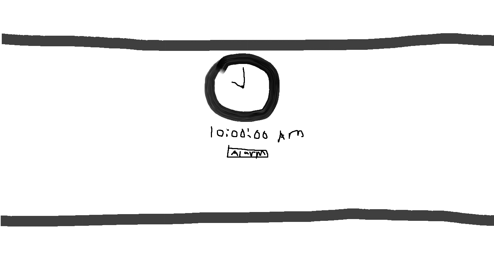

Description: This project will develop a website featuring both analog and digital clocks that display the current time. Users can set alarms through a user-friendly interface, and the website will trigger a specified action when the alarm time is reached. The clocks will update in real-time, and the website will offer a seamless experience for setting and managing alarms.

User Story: As a user, I want a website that displays the current time using both analog and digital clocks and allows me to set alarms to be alerted when a specific time is reached.

Acceptance Criteria:
Clock Display:
Given I am on the website, when I view the homepage, then I should see both an analog and a digital clock displaying the current time.
Setting an Alarm:
Given I am on the settings page, when I input a specific time for an alarm and save it, then the alarm time should be stored.
Alarm Trigger:
Given that I have set and saved an alarm time, when the current time matches the alarm time, the website should trigger the specified action (e.g., display a message, play a sound, or change the theme).
Alarm Persistence:
Given I have set an alarm, when I revisit the website, then the alarm should persist and be checked against the current time to trigger the action if necessary.
Default Behavior:
Given no alarms are set, when I visit the website, then the clocks should display the current time without triggering any alarms.

Notes:
The clocks should update in real-time.
The action triggered by the alarm should be customizable (e.g., play a sound, display a notification, change the theme).
User inputs should be validated to ensure alarm times are correctly formatted and do not conflict.

